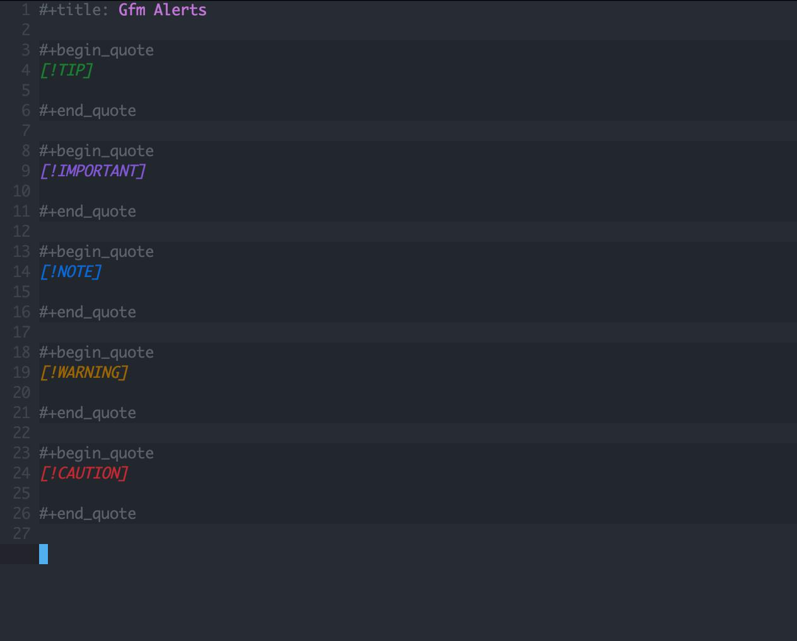

#+title: ~gfm-alerts.el~
#+AUTHOR: Edward Minnix III <egregius313@gmail.com>

Provides syntax highlighting for quote blocks reminiscent of GitHub Flavored
Markdown's Alerts [[https://docs.github.com/en/get-started/writing-on-github/getting-started-with-writing-and-formatting-on-github][(GFM docs)]] or Obsidian's [[https://help.obsidian.md/callouts][callouts]].

* Usage

To enable the syntax highlighting, add ~gfm-alerts-mode~ to the major mode's
hook.

#+begin_src emacs-lisp
(add-hook 'org-mode-hook 'gfm-alerts-mode)
#+end_src

* Supported modes

- ~org-mode~
- ~markdown-mode~
